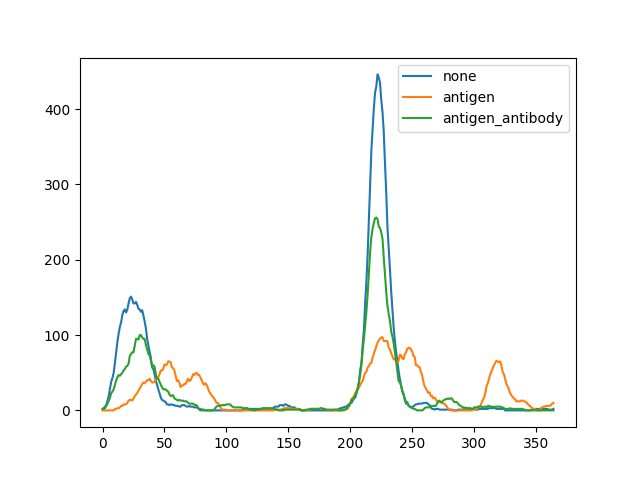
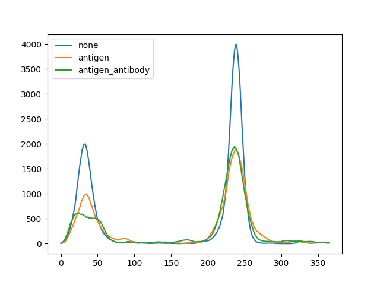
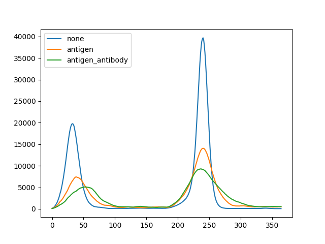
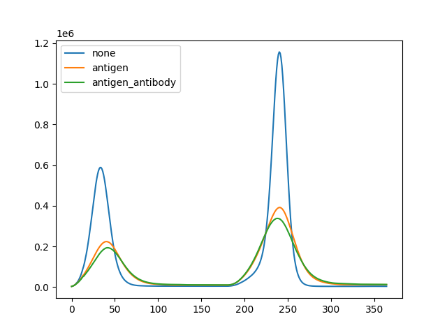
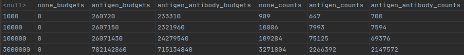

For running the code install the requirements and run the process.py file.

This project represents a simulation of the spread of the COVID-19 disease for different policies. Here is the main assumptions of the simulation.

1. The population consists of people that are described by a list of properties: contagiousness, immunity, being quarantined, being tested positive for antibodies and having symptoms.
2. Whenever someone is infected, his/her contagiousness is generated using the beta distribution.
3. 5 days after the infection symptoms arise, and the person will no longer be in contact with other people.
4. 14 days after the infection the person is healed and acquires immunity against the disease. We assume that the immunity lasts 14 days.
5. In average, everyone meets one person every day. If anyone during the meeting is infected and the other person has no immunity, the infection is transmitted to the other person with probability equal to the contagiousness of the patient.
6. Every day 0.01% of the entire population with no immunity may get infected for reasons other than meeting with others inside the population (ex. traveling).

3 possible policies are compared.
1. No action is taken. Only people with symptoms are quarantined.
2. Antigen tests are performed regularly (once every 14 days) on people who were not infected during the last 170 days. If the result is positive, the person is quarantined for 14 days.
3. Antibody tests are performed as well. If antibodies are detected, the person gets a 170 day free pass (no quarantining, and no testing). If the person is in his late days of infection, he/she is quarantined in addition. People with not free pass et antibody tests once every 60 days and antigen tests once every 14 days.

Initially we assume that 25% of the population has immunity and 0.1% has the disease.

Here is the plot of the number of currently infected people against days passed for all 3 scenarios for 4 different population sizes.

1000 people

10000 people

100000 people

3000000 people

Here is the numerical comparison of the annual budgets and the total number of people infected in 365 days for all 3 policies

As we see, the 3-rd policy is more efficient as less people are infected for big populations and less budget is needed.